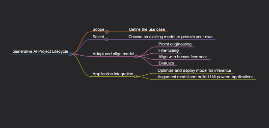
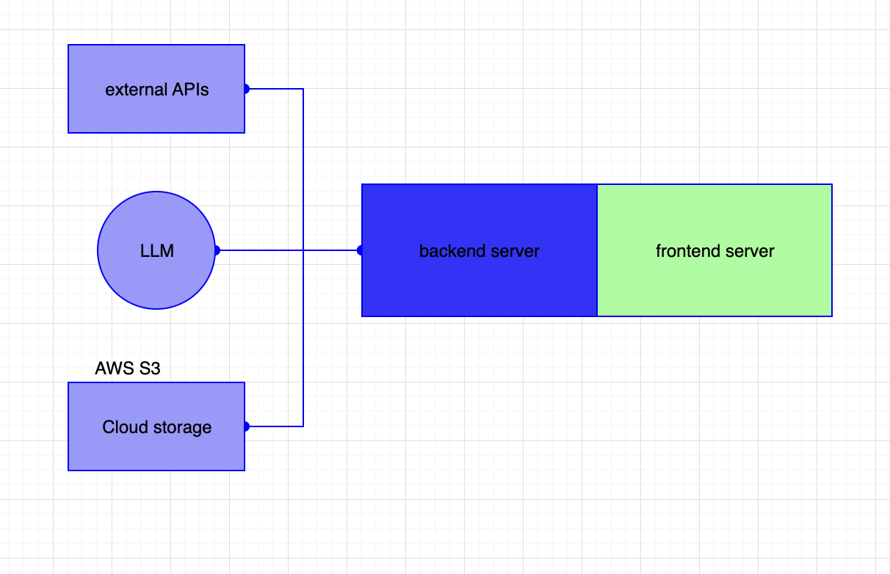

# Generative AI Project Lifecycle
The emergence of Generative AI has revolutionized industries, empowering organizations to create everything from text and images to music and code. However, deploying a generative AI project requires careful planning, development, and management. In this blog post, we'll explore the lifecycle of a generative AI project, breaking it down into essential phases to ensure success.

## Scope 

## Select 

## Adapt and align 

## Application Integration 
