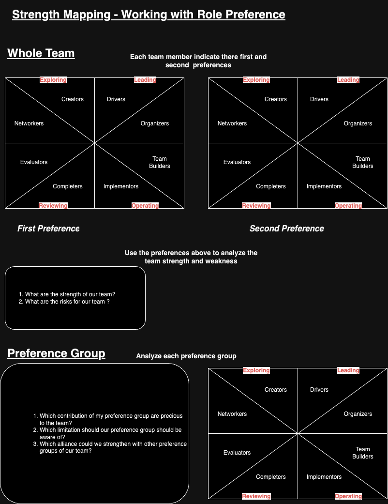

# Unveiling Strength Mapping: Leveraging Role Preferences for Team Success

In today's dynamic and collaborative work environment, understanding and harnessing the unique strengths within your team is essential for achieving success. Strength mapping, when coupled with a thorough understanding of role preferences, can be a powerful tool in optimizing team performance. In this blog post, we'll explore the concept of strength mapping within a team context and delve into the role preferences of team members to unlock their potential.

<!-- more -->

## Whole Team Strengths and Risks

Before we delve into individual role preferences, it's crucial to assess the collective strengths and risks of your team as a whole. This holistic perspective provides a foundation for effective strength mapping:

- Strengths of Our Team: Recognizing the strengths of your team as a whole allows you to understand the qualities that set your group apart. These strengths can include a diverse skill set, strong communication, adaptability, and a shared vision.

- Risks for Our Team: Identifying potential risks is equally important. Risks might include communication gaps, conflicts, lack of diversity in perspectives, or resource limitations. Recognizing these risks empowers your team to proactively address them.

## Preference Group Contributions

Understanding role preferences within your team is vital for optimizing collaboration. Here, we explore the roles and contributions of various preference groups and highlight the precious aspects they bring to the team:

- Networking: This group excels at making contacts and seeking resources outside the team. Their ability to connect with external partners can open doors to new opportunities. However, they should be aware of potential limitations, such as over-enthusiasm and a tendency to lose interest quickly.

- Creator: As potential sources of innovative ideas and solutions, creators can drive your team's success. However, they may need to work on being less sensitive to critical evaluation of their ideas.

- Reviewing - Completers: Completers ensure deadlines are met and focus on the details, making them valuable for task completion. However, they may seem overly anxious about sticking to the plan and can be less involved in generating new ideas.

- Reviewing - Evaluators: Evaluators bring objectivity to the group, preventing it from going off track. However, their quiet and analytical nature may frustrate others by remaining in the background until the last minute.

- Leading - Driver: Drivers lead from the front, shape tasks, and drive progress. Their competitive nature can be an asset, but they need to be cautious not to come across as aggressive and impatient.

- Leading - Organizer: Organizers harness the team's talents and coordinate work with the team's well-being in mind. However, they should be careful not to appear detached or disengaged from others.

- Operating - Teambuilder: Teambuilders promote a harmonious and cooperative atmosphere. Their ability to make the team feel good is valuable, but they should be aware of their tendency to avoid conflict and potential indecisiveness.

- Operating - Implementor: Implementors break down big ideas into actionable details and are focused on execution. However, they may resist changes and appear disinterested in anything other than the task at hand.

## Conclusion

Understanding the role preferences and strengths within your team is the first step towards effective strength mapping. By recognizing the contributions and limitations of each group, you can leverage the collective potential of your team, leading to improved collaboration, innovation, and overall success. The combination of strength mapping and role preference awareness can be a game-changer for your team, helping you navigate challenges and maximize your potential.

***

## Template

